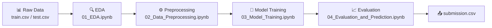

# OctWave 3.0 — Credit Card Fraud Detection Challenge

> **Team BigBug** | August 2026

## Overview

This repository contains our solution for the **OctWave 3.0** challenge — building a machine learning system to detect fraudulent credit card transactions from a highly imbalanced dataset (98.5% legitimate / 1.5% fraud).

Our approach combines **domain-driven feature engineering** (16 new features), **Optuna-based Bayesian hyperparameter tuning** across 9 models, and an optimized **Soft Voting Ensemble** — achieving an outstanding **0.9959 Cross-Validation F1-Score** with perfect precision.

## Final Results

| Metric | Score |
|---|:---:|
| **F1-Score** | **0.9959** |
| **Precision** | 1.0000 |
| **Recall** | 0.9917 |
| **PR-AUC** | 0.9991 |

**Final Model:** Optuna-Weighted Soft Voting Ensemble (AdaBoost + XGBoost + CatBoost + LightGBM + GradientBoosting)

## Pipeline Architecture



## Project Documentation

| Document | Description |
|---|---|
| [Project Summary](docs/project_summary.md) | Full methodology with architecture diagrams, feature engineering details, model comparison, and ensemble strategy |
| [Technical Brief](docs/reference/technical_brief.md) | Competition rules, dataset specification, and evaluation criteria |

## Repository Structure

```text
BigBug_Octwave/
├── data/
│   ├── raw/                 # train.csv, test.csv, sample_submission.csv
│   └── processed/           # Processed datasets / extracted features
├── docs/
│   ├── reference/           # technical_brief.md & administrative_rules.md
│   └── project_summary.md   # Full methodology & architecture overview
├── models/                  # Saved model artifacts (.pkl)
├── src/                     # Python source code
│   ├── data_processing/     # Data analysis and preprocessing scripts
│   ├── inference/           # Inference scripts for predicting on the test set
│   └── modeling/            # Model training and ensemble scripts
├── notebooks/               # Jupyter notebooks (EDA → Preprocessing → Training → Evaluation)
├── outputs/                 # Final submission CSV files
├── README.md                # This file
└── requirements.txt         # Package dependencies
```

## Reproduction Instructions

### 1. Environment Setup

Python 3.11+ is required. Install all dependencies:

```bash
pip install -r requirements.txt
```

### 2. Generating the Solution via Notebooks (Recommended)

The entire pipeline is documented end-to-end across 4 polished Jupyter notebooks. **This is the recommended way to review and reproduce our work:**

| Step | Notebook | What It Does |
|:---:|---|---|
| 1 | `notebooks/01_EDA.ipynb` | Explore distributions, correlations, and fraud patterns |
| 2 | `notebooks/02_Data_Preprocessing.ipynb` | Clean data and engineer 16 custom features |
| 3 | `notebooks/03_Model_Training.ipynb` | Train & tune 9 models via Optuna, build Soft Voting Ensemble |
| 4 | `notebooks/04_Evaluation_and_Prediction.ipynb` | Evaluate with confusion matrices, ROC/PR curves, threshold analysis, and generate `submission.csv` |

The final submission files are saved to `outputs/from_notebook/submission.csv`.

### 3. Alternative: Running via Python Scripts

```bash
# 1. Preprocess the data
python src/data_processing/preprocess.py

# 2. Train models and generate artifacts
python src/modeling/train.py
python src/modeling/ensemble.py
python src/modeling/advanced_ensemble.py

# 3. Generate predictions
python src/inference/predict.py
```

> **Note:** Ensure your working directory is the project root when executing scripts.
