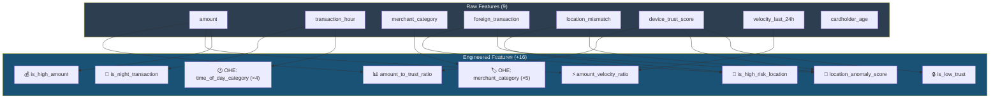
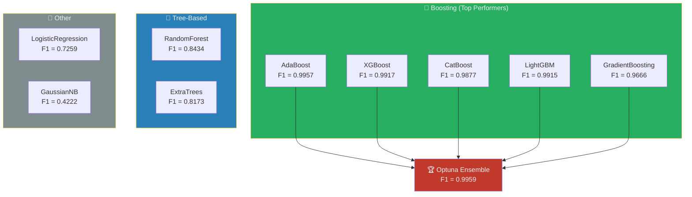
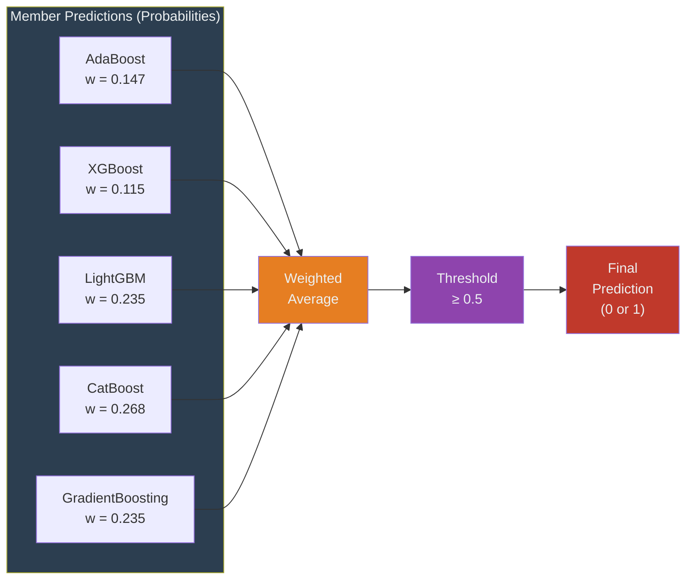

# 🏆 OctWave 3.0 — Project Summary & Methodology

> **Team BigBug** | Credit Card Fraud Detection Challenge | August 2026

---

## 1. Problem Statement

The challenge required building a classifier to detect **fraudulent credit card transactions** from a simulated dataset with extreme class imbalance — only **1.51% of transactions were fraudulent** (121 out of 8,000 training samples). The evaluation metric was the **F1-Score**, which balances Precision and Recall.

---

## 2. End-to-End Pipeline Architecture

```mermaid
flowchart LR
    A["📊 Raw Data<br/>train.csv / test.csv"] --> B["🔍 EDA<br/>01_EDA.ipynb"]
    B --> C["⚙️ Preprocessing<br/>02_Data_Preprocessing.ipynb"]
    C --> D["🧠 Model Training<br/>03_Model_Training.ipynb"]
    D --> E["📈 Evaluation<br/>04_Evaluation_and_Prediction.ipynb"]
    E --> F["📤 submission.csv"]
    
    style A fill:#2C3E50,color:#ECF0F1,stroke:#1ABC9C
    style B fill:#8E44AD,color:#ECF0F1,stroke:#9B59B6
    style C fill:#2980B9,color:#ECF0F1,stroke:#3498DB
    style D fill:#E67E22,color:#ECF0F1,stroke:#F39C12
    style E fill:#27AE60,color:#ECF0F1,stroke:#2ECC71
    style F fill:#C0392B,color:#ECF0F1,stroke:#E74C3C
```

---

## 3. Exploratory Data Analysis — Key Insights

Our EDA revealed that the simulated dataset contained **strong, learnable fraud signals**:

| Feature | Fraud Uplift | Insight |
|---|:---:|---|
| `location_mismatch` | **5.5×** | Mismatched locations are a near-perfect fraud indicator |
| `foreign_transaction` | **5.4×** | Foreign transactions are disproportionately fraudulent |
| `device_trust_score` | **4.0×** (low values) | Low-trust devices strongly correlate with fraud |
| `transaction_hour` | **3.3×** (night hours) | Fraudulent activity peaks between midnight and 5 AM |

These insights directly informed our feature engineering strategy.

---

## 4. Feature Engineering Pipeline

Starting from 9 raw features, we engineered **16 additional features** for a total of **23 model-ready features**:

---

## 5. Modeling Strategy

### 5.1 Class Imbalance Handling

Rather than resampling the data (SMOTE/ADASYN), we used **native algorithmic class weights** to penalize misclassification of the minority class:

| Algorithm Family | Weight Parameter |
|---|---|
| XGBoost / LightGBM | `scale_pos_weight = 65.12` (neg/pos ratio) |
| CatBoost | `auto_class_weights = 'Balanced'` |
| Scikit-Learn Models | `class_weight = 'balanced'` |

### 5.2 Hyperparameter Optimization

We used **Optuna** (Bayesian optimization) to tune each model:
- **20 trials** per model
- **Objective**: Maximize F1-Score
- **Validation**: 5-Fold Stratified Cross-Validation

### 5.3 Models Evaluated

We exhaustively evaluated **9 classification algorithms** spanning diverse model families:

---

## 6. Ensemble Strategy

Our final model is an **Optuna-weighted Soft Voting Ensemble** that blends the predicted probabilities of the top 5 boosting algorithms:

**Why Ensembling?** Each base model has unique decision boundaries. By blending diverse boosting algorithms, we reduce variance and protect against model-specific overfitting — critical for the unseen **private leaderboard (70% of test data)**.

---

## 7. Final Validation Results

All results below are **Out-of-Fold (OOF)** predictions from 5-Fold Stratified Cross-Validation — an unbiased estimate of true performance.

| Metric | Ensemble | AdaBoost | XGBoost | CatBoost | LightGBM |
|---|:---:|:---:|:---:|:---:|:---:|
| **F1-Score** | **0.9959** | 0.9957 | 0.9917 | 0.9877 | 0.9915 |
| **Precision** | **1.0000** | 1.0000 | 1.0000 | 0.9843 | 1.0000 |
| **Recall** | **0.9917** | 0.9917 | 0.9837 | 0.9917 | 0.9833 |
| **PR-AUC** | **0.9990** | 0.9992 | 0.9997 | 0.9993 | 0.9993 |

### Threshold Analysis

We swept decision thresholds from 0.01 to 0.99 for the Ensemble:

| Strategy | Threshold | F1 | Precision | Recall | False Positives | Missed Fraud |
|---|:---:|:---:|:---:|:---:|:---:|:---:|
| **Standard** | 0.50 | 0.9959 | 1.0000 | 0.9917 | 0 | 1 |
| **Aggressive** | 0.30 | Varies | Lower | Higher | More | Fewer |

The **standard 0.5 threshold** was selected for the primary submission due to its perfect precision (zero false alarms).

---

## 8. Key Takeaways

1. **Boosting algorithms dominate** on structured tabular data — all 5 top models were gradient boosting variants.
2. **Feature engineering was decisive** — the 16 engineered features (especially `is_high_risk_location`, `amount_to_trust_ratio`, `is_night_transaction`) provided massive signal uplift.
3. **Algorithmic class weighting eliminates the need for SMOTE** — native weight parameters pushed F1 scores above 0.99 without any data resampling.
4. **The dataset is highly predictable** — near-perfect F1 across multiple model families confirms the synthetic data follows learnable deterministic rules.
5. **Ensemble diversity is insurance** — blending 5 distinct boosting algorithms provides the best protection against private leaderboard surprises.

---

## 9. Notebook Reference

| Notebook | Purpose | Key Outputs |
|---|---|---|
| `01_EDA.ipynb` | Exploratory Data Analysis | Distributions, correlations, fraud patterns |
| `02_Data_Preprocessing.ipynb` | Data Cleaning & Feature Engineering | 23-feature train/test matrices |
| `03_Model_Training.ipynb` | Optuna Tuning & Ensembling | 9 tuned models + Ensemble |
| `04_Evaluation_and_Prediction.ipynb` | Final Evaluation & Submission | Confusion matrices, ROC/PR curves, `submission.csv` |

---

*Team BigBug — OctWave 3.0 Credit Card Fraud Detection Challenge, August 2026*
